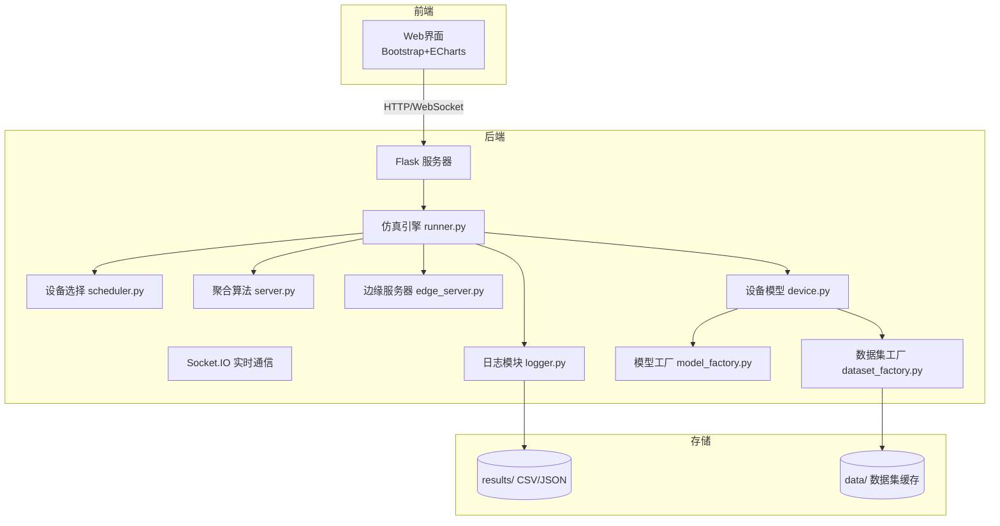

# EdgeFLSim
# 面向边缘智算系统的建模与仿真平台

## 项目简介

本项目是一个面向边缘智算（Edge Intelligence）与联邦学习（Federated Learning）的建模与仿真平台。系统支持异构边缘设备（CPU/GPU）的精细建模、非IID数据划分、多种设备选择策略和全局聚合算法，并提供单基站/多基站两种部署模式。平台具备实时Web监控与交互功能，可动态配置参数、可视化训练过程，并导出实验数据（CSV、JSON）。

## 主要特性

- **异构设备建模**：支持 CPU/GPU 混合，频率、带宽、功率、能耗系数动态波动（±10%）
- **联邦学习全流程**：本地训练 → 上传 → 聚合 → 下发，支持单基站（两级）和多基站（三级，边缘服务器协同）
- **多种设备选择策略**：随机、能量感知、能力感知、混合
- **多种全局聚合算法**：FedAvg、能量加权 FedAvg、FedProx、q‑FedAvg、算力加权平均
- **数据异构性模拟**：IID / Non‑IID 混合划分，偏斜因子可调
- **插拔式模型与数据集**：支持 LeNet5、SimpleCNN、ResNet18 等模型；支持 MNIST、Fashion‑MNIST、EMNIST、CIFAR‑10、CIFAR‑100、SVHN 等数据集
- **实时Web监控**：准确率、能耗、时间、网络流量、公平性曲线；设备状态表及设备级明细表格
- **实验数据导出**：自动生成 CSV 文件（训练结果、设备能耗、设备明细、流量历史）和 JSON 配置

## 技术栈

- **后端**：Python 3.11, PyTorch 2.0, Flask, Flask‑SocketIO, Eventlet
- **前端**：HTML5, Bootstrap 5, ECharts, Socket.IO
- **深度学习**：PyTorch, torchvision
- **数据处理**：NumPy, Pandas, scikit‑learn

## 系统架构

> 详细架构图见下方 Mermaid 描述或 `docs/architecture.png`（建议用 [Mermaid Live Editor](https://mermaid.live/) 渲染）。

